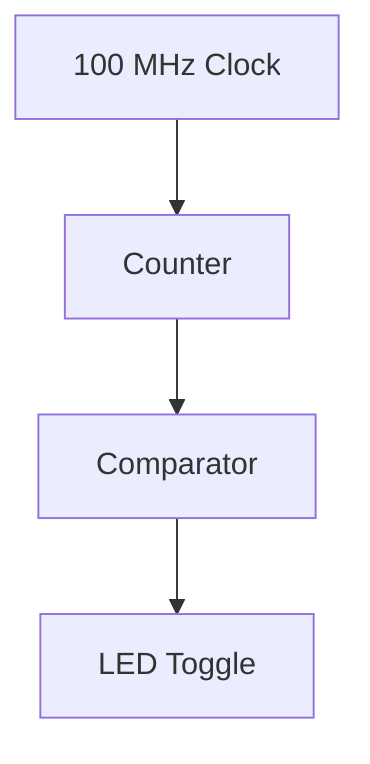

# FPGA Project Report  
## Blink LED on Basys 3 (Artix-7)

---

## 1. Project Overview

**Project Name:** Blink LED  
**Target Board:** Digilent Basys 3  
**FPGA Device:** Xilinx Artix-7 (xc7a35tcpg236-1)  
**Design Language:** VHDL  
**Toolchain:** Vivado  
**Clock Frequency:** 100 MHz  

### Objective
The objective of this project is to design, simulate, synthesize, and implement a simple LED blinking circuit on an Artix-7 FPGA.  
The LED toggles periodically based on the 100 MHz system clock.

---

## 2. Design Architecture

### High-Level Description
The design consists of:
- A synchronous counter driven by a 100 MHz clock
- A comparison against a programmable maximum count
- A flip-flop that toggles the LED output when the counter reaches its maximum value

### Block Diagram (Conceptual)



---

## 3. VHDL Implementation

### Top-Level Entity
- Single clock domain
- Fully synchronous logic
- No asynchronous reset


### Key Parameters
- Counter width sized to support the required delay
- LED toggles every 0.5 seconds, resulting in a 1 Hz blink frequency


```vhdl
entity blink_led is
    generic (
        MAX_COUNT : natural := 50_000_000
    );
    Port ( clk : in STD_LOGIC;      -- 100 MHz
           led : out STD_LOGIC);
end blink_led;
```
---

## 4. Simulation

### Simulation Setup
- Simulator: Vivado Simulator
- Clock period: 10 ns (100 MHz)
- Testbench-generated clock
- Reduced counter value used to accelerate simulation (100 instead of 50_000_000)

### Verification Goals
- Confirm correct LED toggle behavior
- Ensure counter resets correctly
- Verify absence of undefined states (`X`, `U`)

### Results
- LED toggles periodically as expected
- Counter reaches the defined maximum value
- Functional behavior matches design intent

---

## 5. Synthesis Analysis

### Resource Utilization
**Expected results:**
- LUTs: 7
- Flip-Flops: 27
  - 26 FF &rarr; `counter` (26-bit synchronous counter)
  - 1 FF &rarr; `LED` output register 
- BRAM: 0
- DSP: 0

### Analysis
The number of flip-flops directly matches the expected register count derived from the RTL description, confirming that the counter width has been inferred correctly and that no additional registers were unintentionally introduced.

The low LUT utilization indicates that the combinational logic reported for the counter increment, comparison, and LED toogle is minimal. This also suggests that the synthesis tool efficiently mapped the arithmetic operations onto the Artix-7 carry-chain resources.

No block RAM and DSP slices were inferred, which is consistent with the absence of memory structures or complex arithmetic operations in the design.

### Observations
- Resource usage is consistent with a simple, fully synchronous design
- No unintended logic or memory inference detected
- The synthesized logic closely matches the conceptual architecture


### Conclusion
The synthesis results confirm that the RTL design has been correctly interpreted by the toolchain.
The design achieves the intended functionality using a minimal and efficient set of FPGA resources, leaving ample capacity for future extensions.


---

## 6. Implementation and Timing Analysis

### Timing Constraints
- **Primary clock**: 100 MHz 
- **Clock period**: 10 ns

A single global clock domain is used, and no additional timing exceptions or multi-clock constraints are required.

### Timing Summary
- **Worst Negative Slack (WNS)**: + 5.949 ns
- **Total Negative Slack (TNS)**: 0 ns
- **Timing status**: All constraints met

### Timing Analysis
The positive WNS indicates that the longest combinational path between sequential elements completes significantly faster than the 10 ns clock period. This provides a large timing margin and demonstrates that the critical path is short and well-contained.

Given the reported slack, the estimated maximum operating frequency of the design is substantially higher than the target 100 MHz, confirming that the design is not timing-limited under the current constraints.

### Interpretation
The implementation results show that the design comfortably meets its timing requirements with a wide safety margin.
This margin improves robustness against process, voltage, and temperature variations and allows potential future increases in clock frequency or additional logic without immediate risk of timing violations.

### Estimated Maximum Operating Frequency
The reported Worst Negative Slack (WNS) provides an indication of the timing margin available at the target clock frequency.
Based on this margin, an approximate upper bound for the achievable clock frequency can be estimated by subtracting the slack from the constrained clock period.

For a target clock period of 10 ns and a WNS of +5.949 ns, the effective critical path delay can be approximated as:

```
Critical path delay ≈ Clock period − WNS
                     ≈ 10 ns − 5.949 ns
                     ≈ 4.05 ns
```

An approximate maximum operating frequency can then be derived as:

```
Fmax ≈ 1 / Critical path delay
     ≈ 1 / 4.05 ns
     ≈ 247 MHz
```


---

## 7. Warnings and Tool Messages

### Synthesis Warnings
- Parallel synthesis criteria not met  
  *Explanation:* Design is too small to benefit from parallel synthesis.

### Implementation Warnings
- Virtual grid initialization warnings  
  *Explanation:* Tool-related messages not impacting functional correctness.

### Assessment
No warnings affect the correctness or robustness of the design.

---

## 8. Bitstream Generation

- Bitstream generation completed successfully
- Design is ready for deployment on hardware once the target board is available

---

## 9. Engineering Review

### Design Quality Checklist
- [x] Fully synchronous design
- [x] Single clock domain
- [x] Parameterizable timing constants
- [x] Clean simulation results
- [x] Timing constraints met
- [x] Minimal resource usage

### Overall Assessment
The project meets all functional, timing, and implementation requirements and represents a clean and robust FPGA design.

---

## 10. Future Improvements

- Add reset functionality
- Control blinking frequency using switches or buttons
- Drive multiple LEDs
- Introduce a finite state machine (FSM)
- Extend the design with UART or timer modules

---

## 11. Conclusion

This project demonstrates the complete FPGA design flow from VHDL description to simulation, synthesis, and implementation.  
It provides a solid foundation for more complex FPGA-based systems.

---
