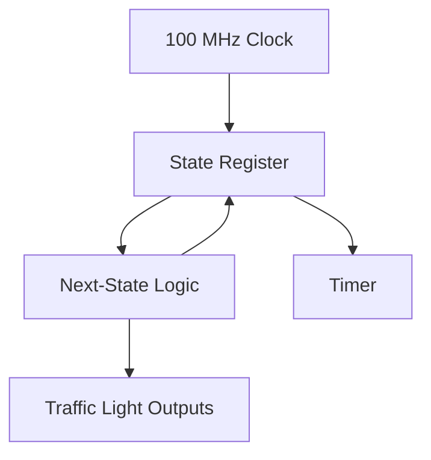

# FPGA Project Report  
## Traffic Light on Basys 3 (Artix-7)

---

## 1. Project Overview

**Project Name:** Traffic Light Controller
**Target Board:** Digilent Basys 3  
**FPGA Device:** Xilinx Artix-7 (xc7a35tcpg236-1)  
**Design Language:** VHDL  
**Toolchain:** Vivado  
**Clock Frequency:** 100 MHz  

### Objective
The objective of this project is to design, simulate, synthesize, and implement a traffic light controller for vehicles and pedestrians on an Artix-7 FPGA.  
The system is based on a synchronous finite state machine (FSM) that manages safe traffic light transitions using a single 100 MHz clock and an active-high reset signal


---

## 2. Design Architecture

### High-Level Description
The design consists of:
- A synchronous finite state machine (FSM)
- A global timer used to control state durations
- A single 100 MHz clock domain
- An active-high synchronous reset (`reset`)
- Dedicated outputs for car and pedestrian traffic lights

The FSM ensures that car and pedestrian green signals are never asserted simultaneously and that all transitions pass through safe all-red states.

### Block Diagram (Conceptual)



---

## 3. VHDL Implementation

### Top-Level Entity
- Single clock domain
- Fully synchronous FSM
- Synchronous active-high reset
- Parameterized timing constants via generics


### Key Parameters
- State durations defined using generics for simulation and hardware scalability
- Safe default reset state (all-red)
- Output signals directly driven by FSM state

```vhdl
entity traffic_light is
    generic (
        T_CAR_YELLOW: natural := 1000;
        T_CAR_GREEN : natural := 200;
        T_ALL_RED   : natural := 100;
        T_PED_GREEN : natural := 800
    );
    Port ( 
        clk          : in STD_LOGIC;
        reset        : in STD_LOGIC;
        car_red      : out STD_LOGIC;
        car_yellow   : out STD_LOGIC;
        car_green    : out STD_LOGIC;
        ped_red      : out STD_LOGIC;
        ped_green    : out STD_LOGIC
    );
end traffic_light;
```
---

## 4. Simulation

### Simulation Setup
- Simulator: Vivado Simulator
- Clock period: 10 ns (100 MHz)
- Testbench-generated clock
- Reduced State durations value to accelerate simulation

### Verification Goals
- Confirm correct FSM state sequencing
- Verify correct timing of each traffic phase
- Ensure car and pedestrian green signals are never asserted simultaneously
- Verify correct behavior during and after reset

### Results
- FSM transitions work perfectly
- No green light asserted simultaneously
- Reset works properly

---

## 5. Synthesis Analysis

### Resource Utilization
**Expected results:**
- LUTs: 28
- Flip-Flops: 34
- BRAM: 0
- DSP: 0

### Analysis
The number of flip-flops directly matches the expected register count derived from the RTL description, confirming that the counter width has been inferred correctly and that no additional registers were unintentionally introduced.

The low LUT utilization indicates that the combinational logic reported for the counter increment, comparison, and FSM output logic is minimal. This also suggests that the synthesis tool efficiently mapped the arithmetic operations onto the Artix-7 carry-chain resources.

No block RAM and DSP slices were inferred, which is consistent with the absence of memory structures or complex arithmetic operations in the design.

### Observations
- Resource usage is consistent with a simple, fully synchronous design
- No unintended logic or memory inference detected
- The synthesized logic closely matches the conceptual architecture


### Conclusion
The synthesis results confirm that the RTL design has been correctly interpreted by the toolchain.
The design achieves the intended functionality using a minimal and efficient set of FPGA resources, leaving ample capacity for future extensions.


---

## 6. Implementation and Timing Analysis

### Timing Constraints
- **Primary clock**: 100 MHz 
- **Clock period**: 10 ns

A single global clock domain is used, and no additional timing exceptions or multi-clock constraints are required.

### Timing Summary
- **Worst Negative Slack (WNS)**: + 4.596 ns
- **Total Negative Slack (TNS)**: 0 ns
- **Worst Hold Slack (WHS)**: + 0.264
- **Timing status**: All constraints met

### Timing Analysis
The positive WNS indicates that the longest combinational path between sequential elements completes significantly faster than the 10 ns clock period. This provides a large timing margin and demonstrates that the critical path is short and well-contained.

Given the reported slack, the estimated maximum operating frequency of the design is substantially higher than the target 100 MHz, confirming that the design is not timing-limited under the current constraints.

### Interpretation
The implementation results show that the design comfortably meets its timing requirements with a wide safety margin.
This margin improves robustness against process, voltage, and temperature variations and allows potential future increases in clock frequency or additional logic without immediate risk of timing violations.

### Estimated Maximum Operating Frequency
The reported Worst Negative Slack (WNS) provides an indication of the available timing margin at the target clock frequency.  
Based on this margin, an approximate upper bound for the achievable clock frequency can be estimated.

For a target clock period of 10 ns and a WNS of +4.596 ns, the effective critical path delay can be approximated as:

```
Critical path delay ≈ Clock period − WNS
                     ≈ 10 ns − 5.596 ns
                     ≈ 5.404 ns
```

An approximate maximum operating frequency can then be derived as:

```
Fmax ≈ 1 / Critical path delay
     ≈ 1 / 5.404 ns
     ≈ 185 MHz
```

This value represents an estimated upper bound rather than a guaranteed operating frequency.


---

## 7. Warnings and Tool Messages

### Synthesis Warnings
- Parallel synthesis criteria not met  
  *Explanation:* Design is too small to benefit from parallel synthesis.

### Implementation Warnings
- Virtual grid initialization warnings  
  *Explanation:* Tool-related messages not impacting functional correctness.

### Assessment
No warnings affect the correctness or robustness of the design.

---

## 8. Bitstream Generation

- Bitstream generation completed successfully
- Design is ready for deployment on hardware once the target board is available

---

## 9. Engineering Review

### Design Quality Checklist
- [x] Fully synchronous design
- [x] Single clock domain
- [x] Parameterizable timing constants
- [x] Clean simulation results
- [x] Timing constraints met
- [x] Minimal resource usage

### Overall Assessment
The project meets all functional, timing, and implementation requirements and represents a clean and robust FPGA design.

---

## 10. Future Improvements

- Add pedestrian request button logic
- Implement minimum and maximum green time constraints
- Add emergency or night mode
- Introduce fault detection and safe fallback states
- Drive a 7-segment display for countdown visualization

---

## 11. Conclusion

This project demonstrates the complete FPGA design flow for a synchronous FSM-based traffic light controller, from VHDL description to simulation, synthesis, and implementation.  
The design meets all functional and timing requirements and provides a scalable foundation for more advanced control logic.

---
